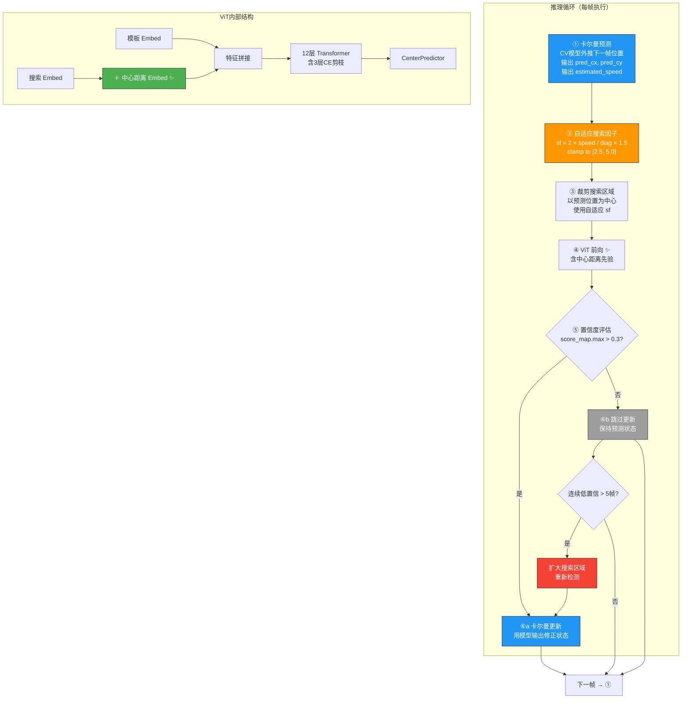

# OSTrack 反无人机跟踪增强 — 设计与实现文档

## 概述

在 OSTrack + OPLoRA 框架基础上引入三重先验增强：

| 先验 | 类型 | 目的 |
|------|------|------|
| 欧几里得距离中心偏置 | 静态空间先验 | 让 ViT 注意力偏向搜索区域中心附近的 token |
| 自适应卡尔曼滤波 | 动态空间先验 | 用运动预测修正搜索区域中心，取代"上一帧位置" |
| 自适应搜索因子 | 动态空间先验 | 根据估计速度自动扩缩搜索区域大小 |

参数全部基于对 Anti-UAV 三个数据集（610 序列、60 万帧转移）的统计分析确定。

---

## 一、欧几里得距离中心偏置（静态空间先验）

### 1.1 原理

OSTrack 将模板和搜索区域的 token 拼接后送入 ViT。自注意力权重完全由 token 内容相似度决定，没有空间偏置。但实际上，由于搜索区域以上一帧目标位置为中心裁剪，**目标更可能出现在搜索区域的中心附近**。

已有的 Hanning 窗口后处理（在 score map 上乘中心高权重）是"事后补救"，模型自身不知道这个先验。

参考 Fan et al. (2026) 的方法：在搜索 token 进入 Transformer 之前，根据每个 token 在特征图上到中心的**欧几里得距离**，为其附加一个可学习的嵌入向量。靠近中心和远离中心的 token 获得不同的嵌入，模型在训练中自行学习如何利用这个距离信息。

### 1.2 修改方式

**新增：** `lib/models/layers/rpe.py` 末尾追加 `generate_center_distance_prior()` —— 对 16×16 特征图上每个位置计算到中心的欧几里得距离，离散化为 N 个 bin，返回每个位置的 bin 索引。这样原本连续的标量距离变成了可以查 embedding 表的离散索引。

**修改：** `lib/models/ostrack/base_backbone.py` 的 `finetune_track()` —— 当 `CENTER_PRIOR.ENABLE=true` 时，创建一个 `nn.Embedding(NUM_BINS, 768)`。768 是 ViT-Base 的 embedding 维度，与位置编码维度一致，可以直接相加。同时把 bin 索引存为 buffer。

**修改：** `base_backbone.py` 和 `vit_ce.py` 的 `forward_features()` —— 在 `x += self.pos_embed_x` 之后，把中心距离 embedding 查出来加到搜索 token 上。注入位置在进入 Transformer blocks 之前，因此全部 12 层都能感知到距离信息。

### 1.3 关键设计决策

**为什么不改 Attention 类而是加 Embedding？** 直接改 Attention 需要处理 CE 消除 token 后的索引跟踪问题，复杂且易出错。而 Embedding 方式附着在 token 上随 CE 自然流转，CE 消除 token 后嵌入也一并消失，无需额外处理。

**为什么用离散 bin 而非连续标量？** 连续标量只能做一个线性缩放（`scale * dist`），表达力有限。离散化后用 Embedding 查表，每个 bin 对应一个 768 维向量，模型可以为不同距离学习完全不同的特征补充。

**参数量**：16 bin × 768 dim = 12K 参数，占 ViT-Base 的 0.014%，可忽略。

---

## 二、自适应卡尔曼滤波（动态空间先验）

### 2.1 原理

原始跟踪器在每帧以上一帧的预测位置为中心裁剪搜索区域——这隐含假设目标在两帧之间位移为零。当无人机快速运动时，目标偏离搜索区域中心，甚至可能超出搜索范围。

卡尔曼滤波器用一个**恒定速度（CV）运动模型**来估计目标状态（位置 + 速度）。每帧先预测目标在下一帧的位置，再以预测位置为中心裁剪搜索区域。模型输出作为观测来修正滤波器状态。

核心创新在**自适应 Q**：标准卡尔曼的过程噪声 Q 是固定的。当无人机突然机动时（急转、加减速），CV 模型的线性假设被打破——滤波器预测和实际观测之间出现大的偏差（innovation Mahalanobis 距离增大）。此时自动放大 Q，使滤波器更信任观测而非模型预测，从而快速跟上机动。平稳飞行时 Q 衰减回基准值。

### 2.2 修改方式

**新增：** `lib/test/tracker/kalman_filter.py` —— 独立的 `AdaptiveKalmanFilter` 类，包含：

- 六维状态 `[cx, cy, w, h, vx, vy]`，用第一帧目标框初始化
- `predict()`：基于 CV 模型外推下一帧位置
- `update()`：用模型输出作为观测，计算卡尔曼增益并修正状态；内部调用 `_adapt_q()` 根据 innovation 的 Mahalanobis 距离自适应调整 Q
- `estimated_speed` 属性：从滤波器状态中提取速度大小，供自适应搜索因子使用

**修改：** `lib/test/tracker/ostrack.py` —— 三个位置的改动：

1. **`__init__`**：从 `cfg.TEST.KALMAN_FILTER` 读取配置，创建 `AdaptiveKalmanFilter` 实例。当 `ENABLE=false` 时 `self.kf = None`，后续逻辑全部走原始路径。

2. **`initialize`**：用第一帧的 ground-truth 框初始化卡尔曼状态，速度设为零。

3. **`track`**：核心流程重构 ——
   - 卡尔曼预测下一帧中心 → 以预测位置裁剪搜索（原：以上一帧位置裁剪）
   - 模型前向 → 将预测框反算回图像坐标
   - 置信度门控：score map 最大值高于阈值时才用模型输出更新卡尔曼；低于阈值时跳过更新，单纯用预测维持轨迹
   - 连续低置信度超过 N 帧 → 触发 `_kf_recovery_attempt()`，用最大搜索因子做一次扩大范围的重新检测

### 2.3 关键设计决策

**为什么用 CV 模型而非更复杂的 CA 或 CTRV？** 帧间时间极短（~33ms），在此尺度上 CV 模型是很好的近似。CA 模型增加了 2 个加速度状态需要估计，在小数据集上更容易发散。自适应 Q 机制弥补了 CV 模型在机动时的不足。

**为什么用 Mahalanobis 距离而非简单的残差大小？** Mahalanobis 距离归一化了观测噪声的影响。同样的像素误差，在目标尺寸大、运动稳定时是异常（应触发 Q 放大），在目标小而抖动时可能是正常的观测噪声（不触发）。

**置信度门控为什么重要？** Anti-UAV 数据集有 `exist=0` 的遮挡帧。在这些帧上模型输出不可靠，如果强行作为观测更新卡尔曼，会把错误的位置信息注入滤波器。门控机制让滤波器在这些帧上"保持预测"，维持合理的轨迹直到目标重新出现。

---

## 三、自适应搜索因子（动态空间先验）

### 3.1 原理

当前 UAV 配置使用固定的搜索因子 3.6。基于对 610 个序列、60 万帧转移的统计分析：

| 搜索因子 | 覆盖率 |
|---------|--------|
| sf=2.5 | 97.5~98.3% |
| **sf=3.6** | **98.7~99.1%** |
| sf=5.0 | 99.4~99.6% |

sf=3.6 在绝大多数帧中已经充分。但在 P99 以上的极端帧（占比 <1%），快速运动使帧间位移超过搜索半边长，目标可能脱离搜索区域。

自适应搜索因子的核心逻辑直接来自物理约束：**搜索半边长必须覆盖预测帧间位移**。

```
搜索半边长 = √(w×h) × sf / 2  ≥  predicted_disp
          →  sf = 2 × predicted_disp / √(w×h)
```

卡尔曼滤波器提供了 `predicted_disp`（来自速度估计）和 `√(w×h)`（来自目标尺寸估计），直接代入公式即可。

再乘以一个安全容限（1.5×），确保预测误差不导致目标出界。

### 3.2 修改方式

**修改：** `lib/test/tracker/ostrack.py` 的 `track()` —— 每帧调用 `_adaptive_search_factor(est_speed, pred_w, pred_h)`，将计算出的搜索因子传给 `sample_target()`。

**新增：** `ostrack.py` 的 `_adaptive_search_factor()` 方法 —— 三行计算：物理所需 → 乘安全容限 → 钳位到 [min, max]。

**修改：** `lib/config/ostrack/config.py` 的 `KALMAN_FILTER` 块 —— 默认 `MIN_SEARCH_FACTOR=2.5`，`MAX_SEARCH_FACTOR=5.0`，`SAFETY_MARGIN=1.5`。

### 3.3 与原始估计的差异

基于估算的设计将自适应搜索因子定性为"应对快速巡航的必需品"，但实测数据显示 sf=3.6 已经覆盖了 ~99% 的帧。自适应搜索因子的真正价值是覆盖 **P99 以上的极端帧**——这些帧占比虽小，但往往是跟踪失败的直接原因。在绝大多数帧中搜索因子维持基准值 3.6，自适应机制不触发额外计算开销。

 好，逐帧推理流程如下：

  ---
  第①步：卡尔曼预测

  输入当前帧（第 t 帧）开始前，卡尔曼滤波器内部维护一个六维状态向量：

  状态 = [cx, cy, w, h, vx, vy]
          ↑   位置（像素坐标）
                    ↑   目标宽高
                          ↑   速度（像素/帧）

  具体操作：用恒定速度（CV）模型外推下一帧：

  pred_cx = cx + vx × dt     # dt = 1（帧间间隔）
  pred_cy = cy + vy × dt
  pred_w  = w
  pred_h  = h

  这里 w, h 保持不变（CV 模型假设尺寸不变）。

  同时从状态中提取 estimated_speed = sqrt(vx² + vy²)，传给下一步。

  例子：上一帧目标在 (100, 200)，速度为 (15, 5) 像素/帧 → 预测本帧中心在 (115, 205)。

  ---
  第②步：自适应搜索因子

  用上一步的速度和预测尺寸，计算搜索因子：

  target_diag = sqrt(w² + h²)
  required_sf = 2 × speed / target_diag    # 物理约束
  safe_sf = required_sf × 1.5              # 安全容限
  sf = clamp(safe_sf, 2.5, 5.0)

  物理含义：搜索半边长 = sqrt(w×h) × sf / 2 必须大于预测位移。公式变形过来就是上面这样。

  例子：目标 30×30 像素，速度 15 px/帧：
  - diag = 42.4
  - required_sf = 2 × 15 / 42.4 = 0.71
  - safe_sf = 0.71 × 1.5 = 1.06
  - clamp 后 sf = 2.5（取下限）

  速度 80 px/帧：
  - required_sf = 2 × 80 / 42.4 = 3.77
  - safe_sf = 3.77 × 1.5 = 5.66
  - clamp 后 sf = 5.0（取上限）

  核心：慢速时 sf=2.5 节省计算，快速时自动扩到 5.0 避免目标出界。

  ---
  第③步：裁剪搜索区域

  以上一步预测位置 (pred_cx, pred_cy) 为中心，用自适应 sf 裁剪搜索图像：

  search_size = 256  # 固定输出尺寸
  crop_size = pred_diag × sf  # 裁剪区域的物理尺寸

  函数 sample_target(image, search_box, sf, output_sz=256)：
  1. 以预测位置为中心，裁出一个 pred_diag × sf 大小的矩形
  2. resize 到 256×256 送入网络

  对比原始逻辑：原始代码以上一帧目标位置（即 self.state 的中心）裁剪，搜索因子固定
  3.6。这里中心换成卡尔曼预测位置，搜索因子自适应。

  ---
  第④步：模型前向（ViT 推理）

  裁剪好的 256×256 搜索图像和 128×128 模板图像分别经过：

  Patch Embed：16×16 卷积 → 模板 64 tokens，搜索 256 tokens，每个 768 维

  加位置编码：x += pos_embed

  注入中心距离先验 ✨：搜索 token 额外加上可学习距离嵌入
  # 每个搜索 token 到搜索区域中心的欧几里得距离 → 离散化为 16 个 bin
  # → 查 nn.Embedding(16, 768) → 加到 token 上
  centre_emb = self.center_dist_embed(self.center_dist_idx)
  x[:, 64:, :] += centre_emb   # 只加在搜索 token 上

  12 层 Transformer（含 3 层 CE 剪枝）→ CenterPredictor 头

  输出：
  - score_map (16×16)：每个位置的目标存在概率
  - size_map (16×16×2)：预测 w, h
  - offset_map (16×16×2)：预测中心偏移

  后处理：score_map 乘汉宁窗口（中心权重高），解码出最终框 (cx, cy, w, h)，值域在 [0, 1] 相对于搜索区域。

  ---
  第⑤步：反算图像坐标

  把模型的输出 (cx, cy, w, h) 从搜索区域坐标系映射回原始图像坐标：

  half_side = 0.5 × search_size / resize_factor
  pred_cx_img = pred_cx + (pred_cx_norm - half_side)   # norm → 图像坐标
  pred_cy_img = pred_cy + (pred_cy_norm - half_side)

  pred_cx 是第①步的卡尔曼预测（图像坐标），pred_cx_norm 是模型的相对输出。

  ---
  第⑥步：置信度门控

  取 score_map.max() 作为置信度，判断：

  情况 A：confidence > 0.3（高置信度）
  - 用模型输出作为观测，更新卡尔曼滤波器
  - kf.update(pred_cx_img, pred_cy_img, pred_w_img, pred_h_img)
  - 滤波器内部：计算 innovation（观测 - 预测），卡尔曼增益修正状态
  - 同时计算 innovation 的 Mahalanobis 距离：
    - 距 > 5.0 → 认为发生机动 → Q × 2.0（更信任观测，快速跟上）
    - 距 ≤ 5.0 → Q × 0.95（衰减回基准，保持平滑）
  - 最终用滤波后的状态（不是原始观测）输出 self.state
  - 低置信计数器归零

  情况 B：confidence ≤ 0.3（低置信度，如遮挡）
  - 不更新卡尔曼（避免注入错误信息）
  - 直接用模型输出（未滤波的）作为 self.state
  - 低置信计数器 +1

  情况 C：连续低置信超过 5 帧（跟丢了）
  - 触发 _kf_recovery_attempt()
  - 用 sf=5.0 重新裁剪一个大范围搜索区域
  - 再次前向推理
  - 如果置信度恢复到 0.21 以上（阈值的 70%），认为找回目标，更新卡尔曼

  ---
  总结：一帧的完整链路

  ① 卡尔曼预测位置    →   ② 计算自适应sf    →   ③ 裁剪搜索区域
                                                  ↓
  ⑥ 置信度门控 ← ⑤ 反算图像坐标 ← ④ ViT前向
      ├─ 高置信: KF更新 → 输出滤波结果
      ├─ 低置信: 跳过更新 → 保持预测
      └─ 跟丢: 扩大搜索重检测 → 恢复
                                                  ↓
                                          下一帧 → ①
---

## 四、数据驱动的参数校准

所有参数的默认值基于对 3 个 Anti-UAV 数据集的统计分析（`tools/analyze_anti_uav_motion.py`）：

| 统计量 | anti_uav | anti_uav410 | anti_uav600 |
|--------|----------|-------------|-------------|
| 序列数 | 320 | 140 | 150 |
| 帧转移数 | 289,975 | 147,656 | 163,306 |
| 目标中位尺寸 | 51.5 px | 29.8 px | 24.1 px |
| 位移 P50 | 5.0 px | 2.5 px | 2.0 px |
| 位移 P95 | 31.1 px | 15.0 px | 14.5 px |
| 位移 P99 | 106 px | 46 px | 41 px |
| sf=3.6 覆盖 | 98.94% | 99.14% | 98.66% |
| sf=5.0 覆盖 | 99.38% | 99.61% | 99.38% |
| sf=5.0 未覆盖的帧数 | ~1,800 | ~580 | ~1,020 |

由此确定 `MIN_SEARCH_FACTOR=2.5`（低于所有数据集的 sf=2.5 覆盖率 >97%）和 `MAX_SEARCH_FACTOR=5.0`（覆盖 99.4%+ 的帧）。`SAFETY_MARGIN=1.5` 意味着即使卡尔曼速度估计有 50% 的误差，目标仍能在搜索区域内。

---

## 五、修改文件清单

| 文件 | 操作 | 改动要点 |
|------|------|---------|
| `lib/models/layers/rpe.py` | 追加函数 | `generate_center_distance_prior()` |
| `lib/models/ostrack/base_backbone.py` | 修改 3 处 | import、`finetune_track()` 创建 embedding、`forward_features()` 注入 |
| `lib/models/ostrack/vit_ce.py` | 修改 1 处 | `forward_features()` 注入（与 base 一致） |
| `lib/test/tracker/kalman_filter.py` | **新建** | `AdaptiveKalmanFilter` 完整实现 |
| `lib/test/tracker/ostrack.py` | 修改 4 处 | import、`__init__`、`initialize`、`track` + 2 个新方法 |
| `lib/config/ostrack/config.py` | 追加 2 块 | `MODEL.CENTER_PRIOR`、`TEST.KALMAN_FILTER` |
| `tools/analyze_anti_uav_motion.py` | **新建** | 数据集统计分析脚本 |

---

## 六、向后兼容

所有新增功能默认关闭：

- `CENTER_PRIOR.ENABLE = False` —— 不启用时 Embedding 层不创建，模型结构与原始完全一致
- `KALMAN_FILTER.ENABLE = False` —— 不启用时 `self.kf = None`，`track()` 自动走原始路径
- 全部通过 `getattr` 读取配置并提供默认值，旧 YAML 无需修改
- 旧 checkpoint 可正常加载（中心偏置 embedding 仅在 `ENABLE=true` 时追加）

---

## 七、三个先验的协同

中心偏置依赖一个前提：**目标确实在搜索区域中心附近**。如果搜索区域中心偏离目标太远，中心偏置反而会产生误导。

卡尔曼滤波器恰好保证了这个前提——它**将搜索中心移动到预测位置**，使目标更可能处于搜索区域中心。自适应搜索因子则确保即使在快速运动时，搜索区域也足够大来包含目标。

三个组件形成闭环：
```
卡尔曼预测中心位置  →  目标在搜索中心附近  →  中心偏置生效  →  模型更准确
     ↑                                                              │
     └──────────── 置信度门控更新 ← 更可靠的模型输出 ←────────────────┘
```
