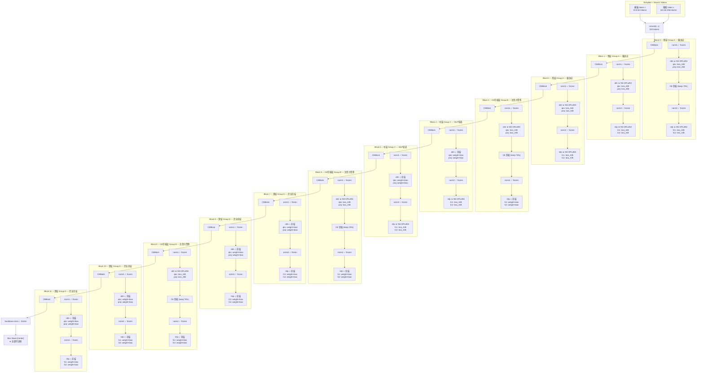

# NS-OPLoRA Block Injection Diagram



---

## 图例

| 符号 | 含义 |
|------|------|
| ★ NS-OPLoRA | 注入了 NeuronSelectiveOPLoRALinear，含 lora_A/B + neuron_mask |
| ◇ 冻结 | 保留原始 nn.Linear，weight+bias 不可训练 |
| ✓ frozen | LayerNorm / 无参数的组件，随 backbone 冻结 |

## 分组汇总

```
Block:  0    1    2    3    4    5    6    7    8    9    10   11
        ────────────────         ───         ─────────         ──────
attn:   ★    ★    ★    ★    ◇    ◇    ★    ◇    ◇    ★    ◇    ◇
mlp:    ★    ★    ★    ◇    ★    ★    ◇    ◇    ◇    ◇    ◇    ◇
CE:     -    -    -    ✓    -    -    ✓    -    -    ✓    -    -

Group:  A──────────    B    C────    B    D────────    B    D────────
```

