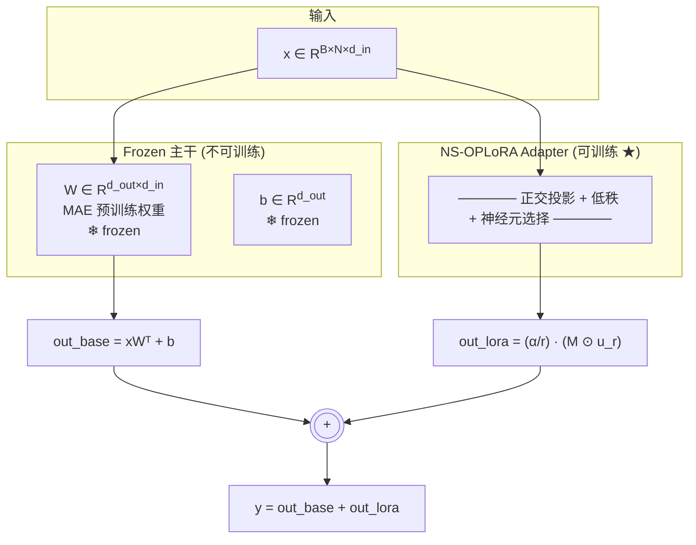
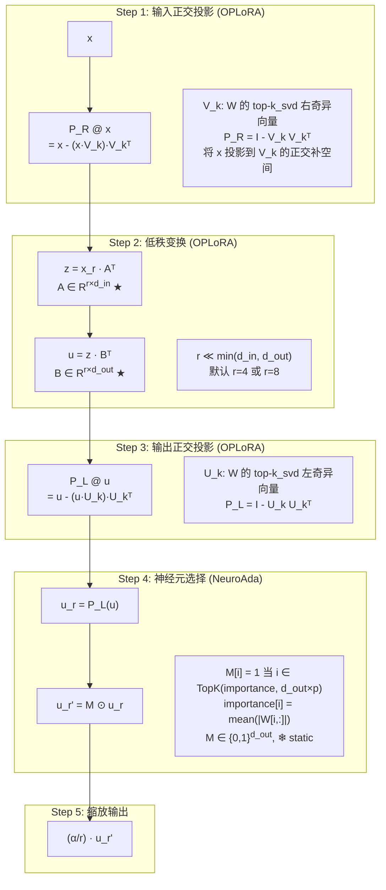
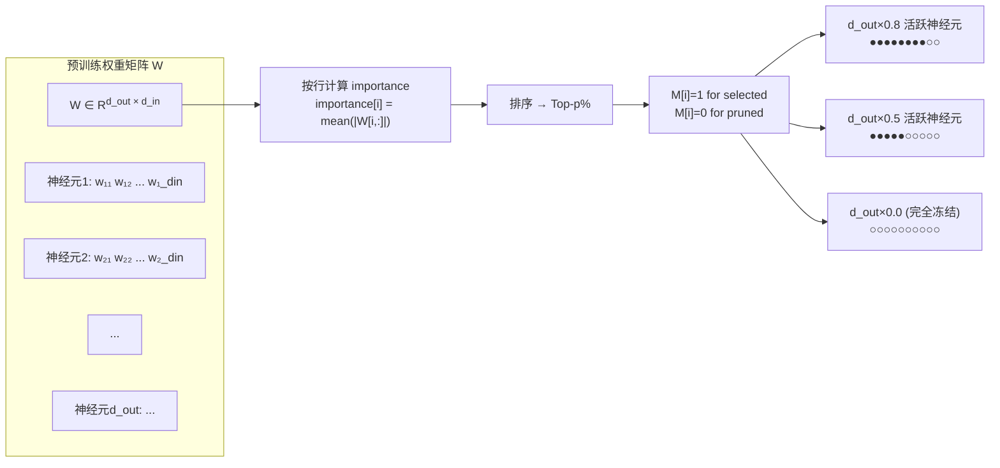
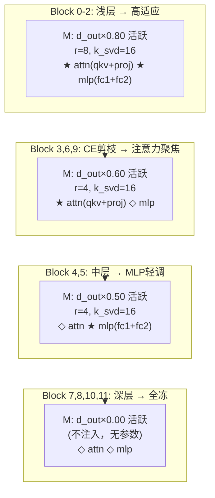

# NS-OPLoRA 原理公式图

## 1. 总体结构



## 2. Adapter 内部展开



## 3. 神经元选择 (NeuroAda) 细节



## 4. 完整前向公式

```
给定:
  W ∈ R^{d_out×d_in}   frozen 预训练权重
  b ∈ R^{d_out}         frozen bias
  U_k ∈ R^{d_out×k_svd} top-k_svd 左奇异向量
  V_k ∈ R^{d_in×k_svd}  top-k_svd 右奇异向量
  A ∈ R^{r×d_in}        可训练 ★
  B ∈ R^{d_out×r}       可训练 ★
  M ∈ {0,1}^{d_out}     静态神经元掩码 ❄
  α ∈ R                 缩放因子
  r ∈ N                 低秩维度

Forward:
  out_base = x @ W^T + b                             ... 冻结通路

  x_r   = x - (x @ V_k) @ V_k^T                      ... 输入正交投影
  z     = x_r @ A^T                                   ... 降维 r
  u     = z @ B^T                                     ... 升维 d_out
  u_r   = u - (u @ U_k) @ U_k^T                       ... 输出正交投影
  u_r'  = M ⊙ u_r                                     ... 神经元掩码
  out   = out_base + (α/r) * u_r'                     ... 残差融合

梯度:
  ∂L/∂A  ← 仅通过被选中神经元反向传播
  ∂L/∂B[i,:] = 0  当 M[i] = 0
  ∂L/∂W = 0, ∂L/∂U_k = 0, ∂L/∂V_k = 0, ∂L/∂M = 0   ... 全部冻结

推理 (merge):
  W_merged = W + (α/r) * diag(M) @ B @ A
  → 恢复为标准 nn.Linear，零额外开销
```

## 5. 层间差异化配置



---

| 符号 | 来源 | 含义 |
|------|------|------|
| U_k, V_k, P_L, P_R | **OPLoRA** | SVD 正交投影，保护预训练主成分 |
| A, B, r, α | **OPLoRA** | 低秩适配矩阵，在正交子空间内学习 |
| M, importance[i] | **NeuroAda** | 神经元级幅值选择，每行独立决策 |
| per-block config | **本方案** | 层自适应差异化，按反无人机任务定制 |
