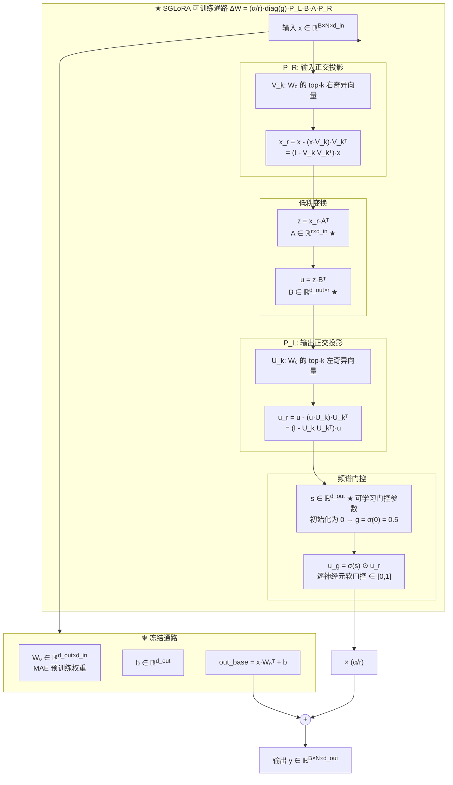
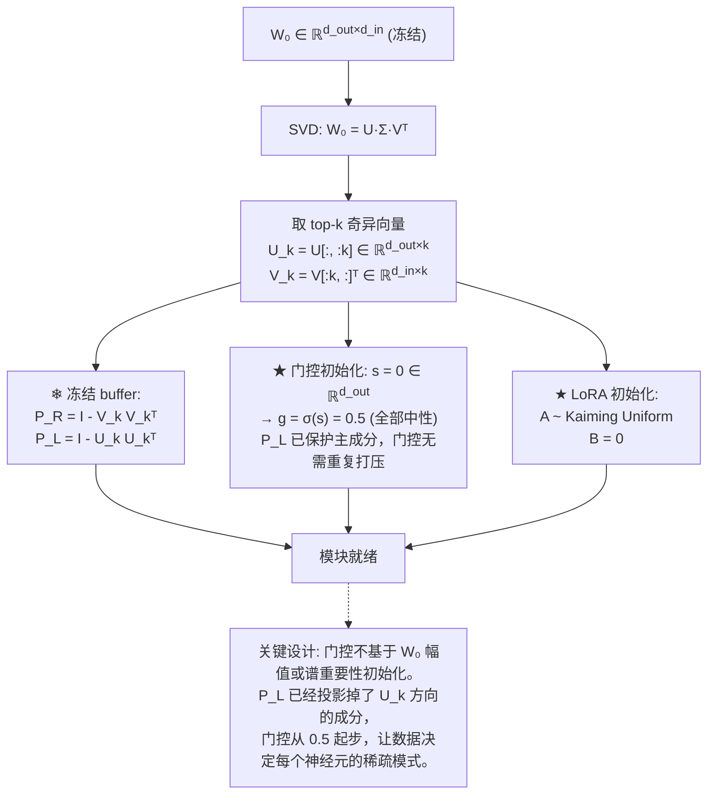
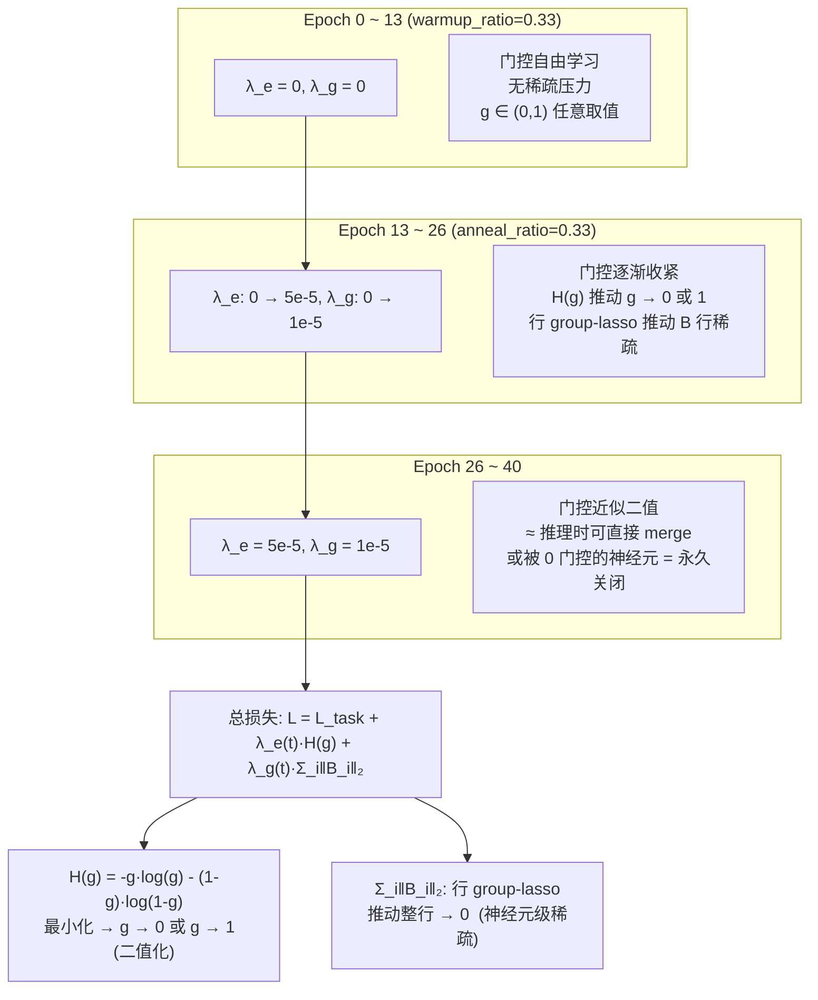
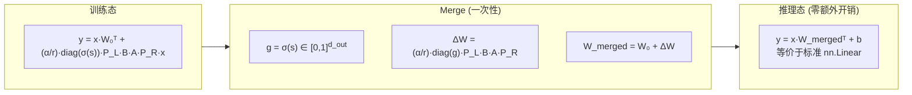
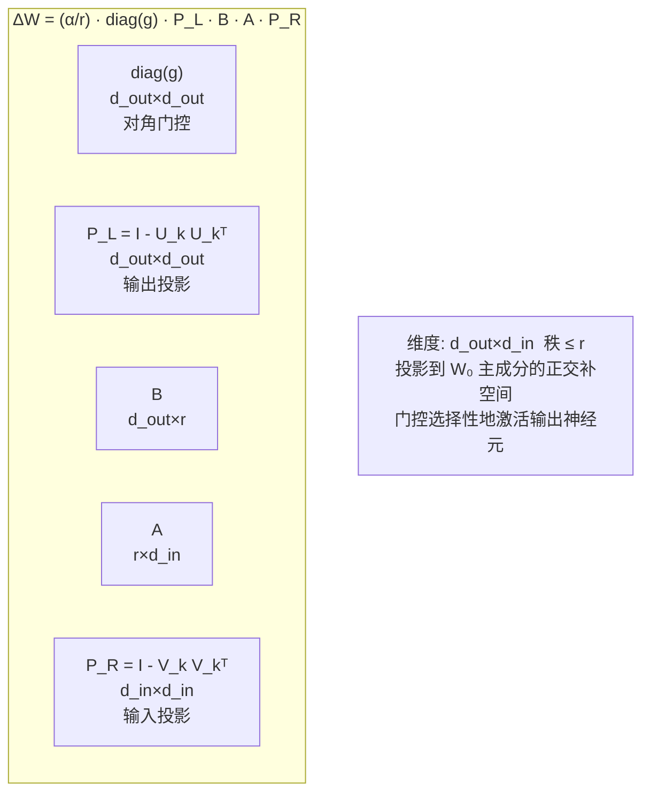

# SGLoRA 算法流程图

## 1. 完整前向传播

## 2. 初始化流程

## 3. 训练过程 & 熵调度

## 4. 推理 / Merge

## 5. δW 结构展开

## 关键公式总结

| 组件 | 公式 | 状态 |
|------|------|------|
| 冻结权重 | W₀, b | ❄ 不可训练 |
| 输入投影 | P_R = I - V_k V_kᵀ | ❄ SVD 缓存 |
| 输出投影 | P_L = I - U_k U_kᵀ | ❄ SVD 缓存 |
| 低秩矩阵 | A ∈ ℝ^{r×d_in}, B ∈ ℝ^{d_out×r} | ★ 可训练 |
| 频谱门控 | g = σ(s), s ∈ ℝ^{d_out} | ★ 可训练，从 0.5 初始化 |
| 熵正则 | H(g) = -Σ[g·log(g) + (1-g)·log(1-g)] | 动态调度 λ_e(t) |
| 行稀疏 | Σ_i ‖B_{i,:}‖₂ | 动态调度 λ_g(t) |
| 最终适配 | ΔW = (α/r)·diag(g)·P_L·B·A·P_R | — |

## 与 NS-OPLoRA 的差异

| | NS-OPLoRA | SGLoRA |
|---|---|---|
| 公式 | ΔW = (α/r)·M⊙P_L·B·A·P_R | ΔW = (α/r)·diag(g)·P_L·B·A·P_R |
| 门控 | M ∈ {0,1}, 静态, 基于 mean(\|W₀\|) | g = σ(s) ∈ [0,1], 可学习, 中性初始化 |
| 稀疏化 | 固定 keep_ratio | 熵 + group-lasso 动态调度 |
| 门控和 P_L 的关系 | 无交互（先后独立作用） | 门控放 P_L 之后，互补不重复 |

![[mermaid-diagram.png]]