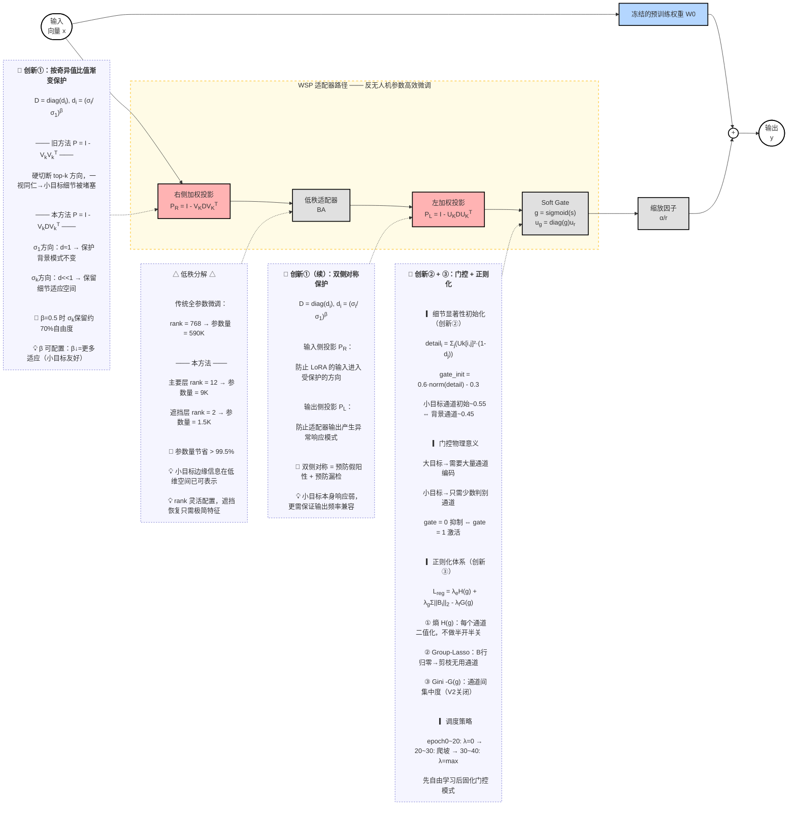

```mermaid
graph LR
    %% 节点样式定义
    classDef inputOutput fill:#FFFFFF,stroke:#000000,stroke-width:2px;
    classDef frozen fill:#B4D6FF,stroke:#000000,stroke-width:2px;
    classDef proj fill:#FFB3B3,stroke:#000000,stroke-width:2px;
    classDef grayBlock fill:#E0E0E0,stroke:#000000,stroke-width:2px;
    classDef op fill:#FFFFFF,stroke:#000000,stroke-width:2px;
    classDef note fill:#F5F5FF,stroke:#6666CC,stroke-width:1px,stroke-dasharray: 3 3;

    %% 核心节点
    X([输入<br>向量 x]):::inputOutput
    W0[冻结的预训练权重 W0]:::frozen
    Y([输出<br>y]):::inputOutput
    Add(( + )):::op

    %% WSP适配器子图
    subgraph WSP [WSP 适配器路径 ─── 反无人机参数高效微调]
        PR[右侧加权投影<br>P<sub>R</sub> = I - V<sub>K</sub>DV<sub>K</sub><sup>T</sup>]:::proj
        BA[低秩适配器<br>BA]:::grayBlock
        PL[左加权投影<br>P<sub>L</sub> = I - U<sub>K</sub>DU<sub>K</sub><sup>T</sup>]:::proj
        Gate["Soft Gate<br>g = sigmoid(s)<br>u<sub>g</sub> = diag(g)u<sub>r</sub>"]:::grayBlock
    end

    %% 虚线框外部的缩放因子
    Scale[缩放因子<br>α/r]:::grayBlock

    %% ─── 创新点解释小块（对应每个组件下方）───

    PR_note["
        <b>🔑 创新①：按奇异值比值渐变保护</b><br>
        D = diag(d<sub>i</sub>), d<sub>i</sub> = (σ<sub>i</sub>/σ<sub>1</sub>)<sup>β</sup><br><br>
        ─── 旧方法 P = I - V<sub>k</sub>V<sub>k</sub><sup>T</sup> ───<br>
        硬切断 top-k 方向，一视同仁→小目标细节被堵塞<br><br>
        ─── 本方法 P = I - V<sub>k</sub>DV<sub>k</sub><sup>T</sup> ───<br>
        σ<sub>1</sub>方向：d≈1 → 保护背景模式不变<br>
        σ<sub>k</sub>方向：d<<1 → 保留细节适应空间<br><br>
        🎯 β=0.5 时 σ<sub>k</sub>保留约70%自由度<br>
        💡 β 可配置：β↓=更多适应（小目标友好）
    "]:::note

    BA_note["
        △ 低秩分解 △<br><br>
        传统全参数微调：<br>
        rank = 768 → 参数量 = 590K<br><br>
        ─── 本方法 ───<br>
        主要层 rank = 12 → 参数量 = 9K<br>
        遮挡层 rank = 2 → 参数量 = 1.5K<br><br>
        🎯 参数量节省 > 99.5%<br>
        💡 小目标边缘信息在低维空间已可表示<br>
        💡 rank 灵活配置，遮挡恢复只需极简特征
    "]:::note

    PL_note["
        <b>🔑 创新①（续）：双侧对称保护</b><br>
        D = diag(d<sub>i</sub>), d<sub>i</sub> = (σ<sub>i</sub>/σ<sub>1</sub>)<sup>β</sup><br><br>
        输入侧投影 P<sub>R</sub>：<br>
        防止 LoRA 的输入进入受保护的方向<br><br>
        输出侧投影 P<sub>L</sub>：<br>
        防止适配器输出产生异常响应模式<br><br>
        🎯 双侧对称 = 预防假阳性 + 预防漏检<br>
        💡 小目标本身响应弱，更需保证输出频率兼容
    "]:::note

    Gate_note["
        <b>🔑 创新② + ③：门控 + 正则化</b><br><br>
        ▎细节显著性初始化（创新②）<br>
        detail<sub>i</sub> = Σ<sub>j</sub>(Uk[i,j]²·(1-d<sub>j</sub>))<br>
        gate_init = 0.6·norm(detail) - 0.3<br>
        小目标通道初始~0.55 ⇔ 背景通道~0.45<br><br>
        ▎门控物理意义<br>
        大目标→需要大量通道编码<br>
        小目标→只需少数判别通道<br>
        gate = 0 抑制 ⇔ gate = 1 激活<br><br>
        ▎正则化体系（创新③）<br>
        L<sub>reg</sub> = λ<sub>e</sub>H(g) + λ<sub>g</sub>Σ||B<sub>i</sub>||<sub>2</sub> - λ<sub>f</sub>G(g)<br>
        ① 熵 H(g)：每个通道二值化，不做半开半关<br>
        ② Group-Lasso：B行归零→剪枝无用通道<br>
        ③ Gini -G(g)：通道间集中度（V2关闭）<br><br>
        ▎调度策略<br>
        epoch0~20: λ=0 → 20~30: 爬坡 → 30~40: λ=max<br>
        先自由学习后固化门控模式
    "]:::note

    %% ─── 连线 ───
    X --> W0
    X --> PR
    PR --> BA
    BA --> PL
    PL --> Gate
    Gate --> Scale
    W0 --> Add
    Scale --> Add
    Add --> Y

    %% ─── 创新块与对应组件的连接 ───
    PR_note -.-> PR
    BA_note -.-> BA
    PL_note -.-> PL
    Gate_note -.-> Gate

    %% ─── 样式 ───
    style WSP fill:#FFFBE6,stroke:#FFD666,stroke-width:2px,stroke-dasharray: 5 5
```
